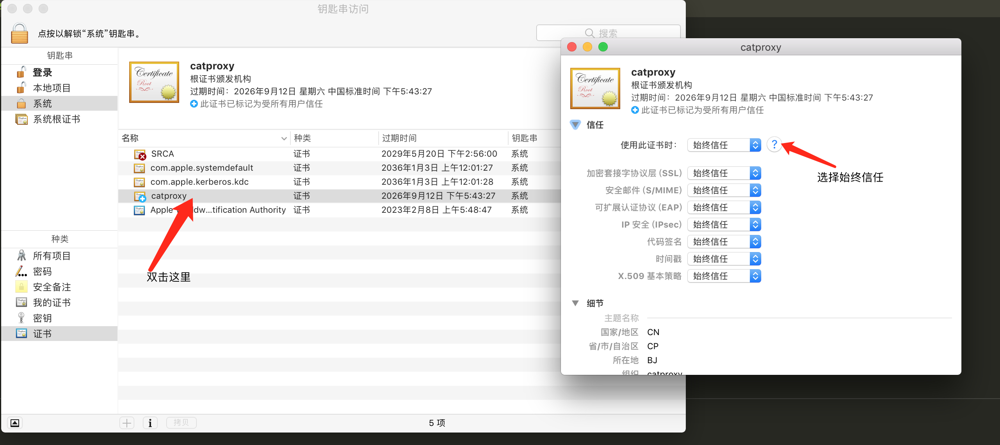
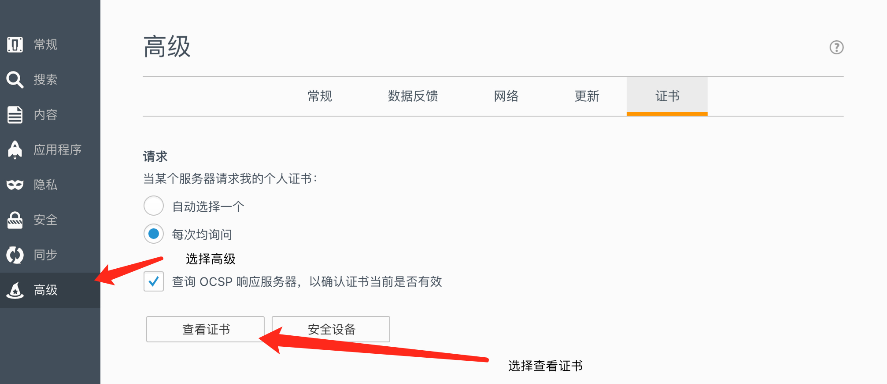
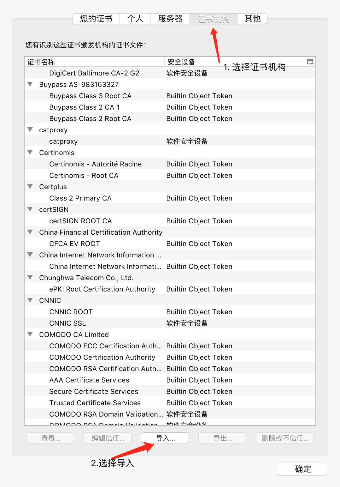
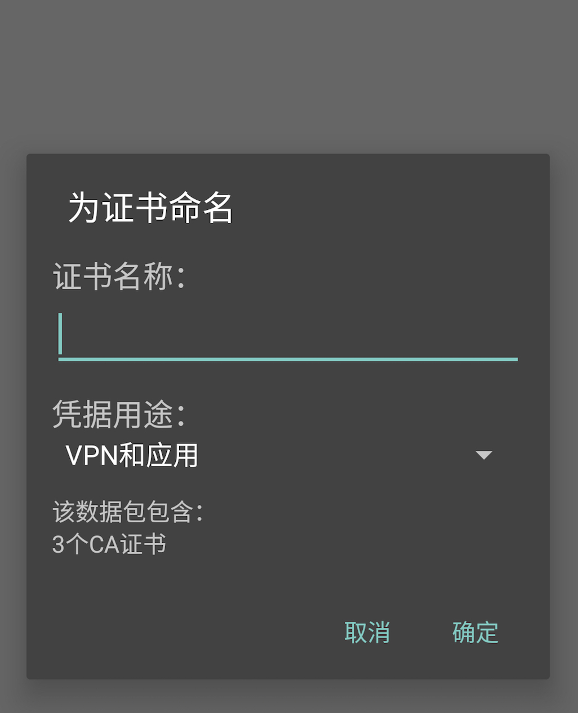

# https使用说明

> https 采用加密的通道传输数据，需要用到证书，客户端必须要安装证书，才能够正确地代理请求

## 证书生成
采用命令 `catproxy -c` 生成证书，生成后会有日志打印出目录，在目录中可以找到日志文件，也可以通过ui界面找到配置文件

## 打开https破解
用命令`catproxy -b  true`打开https得破解

## mac 安装证书
1. 双击证书文件
2. 进入钥匙串app,找到catproxy, 双击catproxy，使用此证书时选择**始终信任**

### 图形说明

## win安装证书

1. 双击证书文件
2. 选择在指定目录安装证书
3. 选择受信用的根目录证书

### 图形说明

## firefox 安装证书

1. 由于firefox不认系统的证书，需要单独安装证书
2. 打开firefox的设置
3. 选择高级
4. 选择 tab中的证书选项
5. 选择查看证书
6. 选择 tab中得 证书机构
7. 选择导入证书，将根证书导入，根证书可以通过 ui界面下载得到

### 图形说明

## android 安装证书

1. 设置android手机解锁方式为密码解锁（android手机要安装证书必须设置开机密码并且开机密码必须是数字类型）
2. 在catproxy下打开证书二维码，用手机扫描 （注意此时打开管理页面必须是本机的ip并且手机在同一个局域网内，本机ip不能是127.0.0.1或者localhost）

### 图文说明

