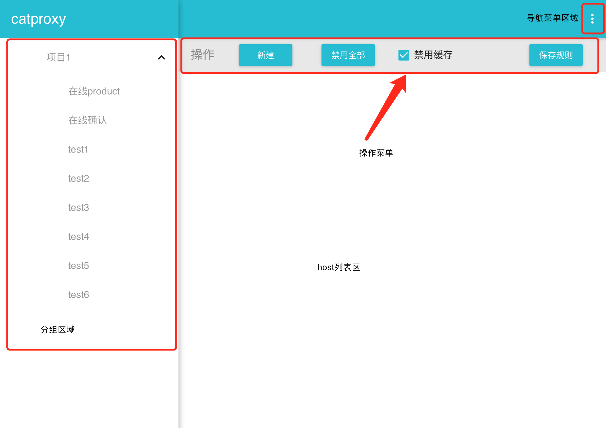
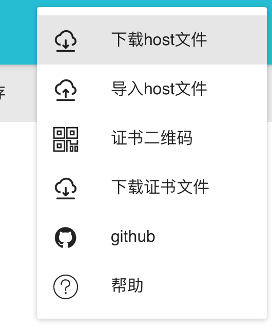
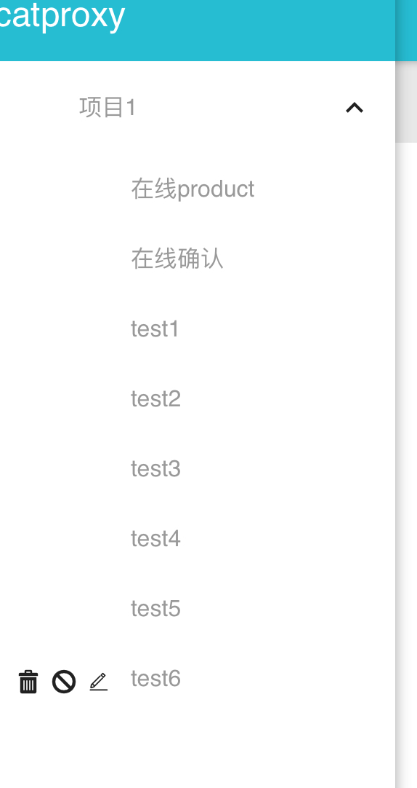
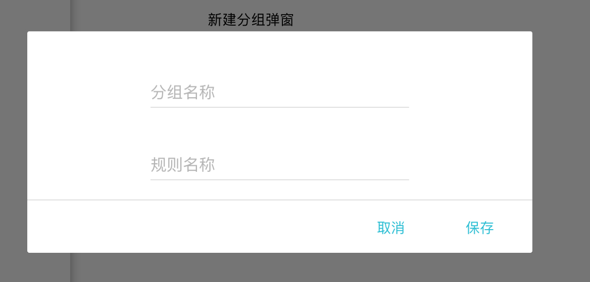
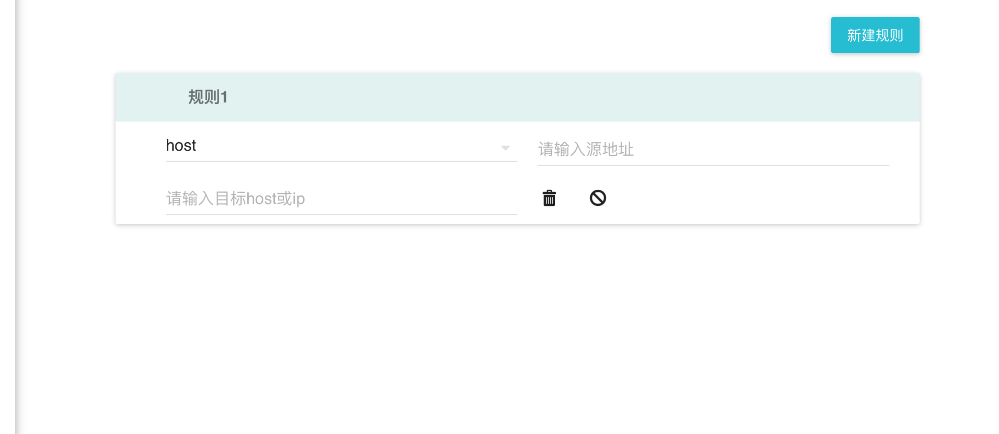

# 管理界面说明

整体界面主要由
1. 左侧分组菜单
2. 顶部导航菜单
3. 中间的操作菜单

分组菜单主要是标记当前项目的分组

顶部导航菜单主要是一些导航功能

中间操作菜单主要是一些基础操作

## 导航区域

1. 下载host文件，即host的配置文件
2. 导入host配置文件，下载后得配置文件可以通过整个导入 
3. 下载证书文件
4. 证书文件二维码，即可扫二维码去下载证书文件
5. 帮助

## 分组区域

分组区域是一个二级树列表,一级表示分组,二级表示分组下地host配置,可以通过操作菜单中得 **新建** 创建新的分组 

分组在鼠标悬浮状态下，会有三个图标按钮分别表示删除、禁止使用、编辑

编辑将会编辑当前分组的名称，禁止使用将会禁止当前分组下的所有规则, 删除将会删除当前分组

点击二级host配置菜单，将会在右侧的host列表区域显示当前分组列表下地host配置，可以进行设置

## 操作菜单

操作菜单主要有新建分组、禁止所有分组、禁止缓存的功能

1. 禁止所有分组 即将所有分组都禁止，这个时候所有的资源将会定位到在线
2. 禁止缓存所有请求 将会去掉缓存
3. 新建分组 新建一个分组菜单,可以选择一个分组的名称,和二级分组的名称,如下图所示

**所有修改必须点击保存，才能生效**

## host列表区域

host列表区域可以设置具体的规则

通过新建按钮可以新建一个规则

所有得规则源地址可以是一个正则表达式，也可以是一个 url

规则类型总共有7个类型

### host
即将一个host地址指定到一个固定的ip下 如 源地址填写http://163.com/test,目标地址填写86.86.86.86将会将 163.com/test目录下地都指定到86.86.86.86的ip下,其他目录下还是会访问在线

### 本地文件 
如源地址填写http://163.com/test.js, 目标地址填写d:\\test\\test.js, 将会将http://163.com/test.js定位到本地test的文件

### 本地目录
如源地址填写http://pimg1.126.net/cnd1/ 目标地址填写  d:\\test 将会在本地磁盘  test目录下寻找cdn1目录下对应目录对应的资源文件, 这里为了防止文件夹不匹配 引入虚拟路径的字段，虚拟路径配置表示本地不存在的一个路径，但是cdn路径中又使必须得完成匹配

### 远程文件 
如源地址填写http://163.com/test.js 目标地址填写  http://126.net/test.js 将会将 地址http://126.net/test.js的内容加载到 http://163.com/test.js下

### 重定向
如源地址填写 http://qq.com 目标地址填写 http://163.com 将会将qq.com重定向到 163.com

### weinre
选择正则替换后将会在源地址中插入weinre的script，并且开启weinre服务器,weinre服务器的url会在控制台打印

### 正则替换
源地址的正则的子匹配，目标地址可以通过$1-$9取到并进行替换
