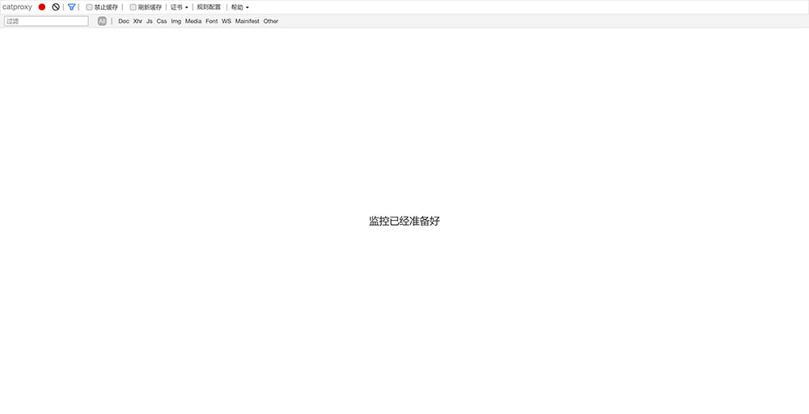
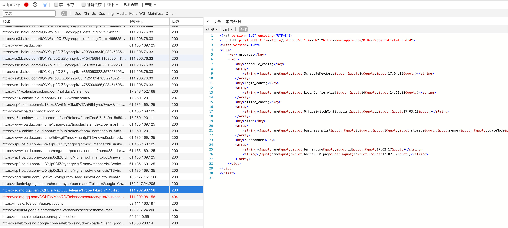
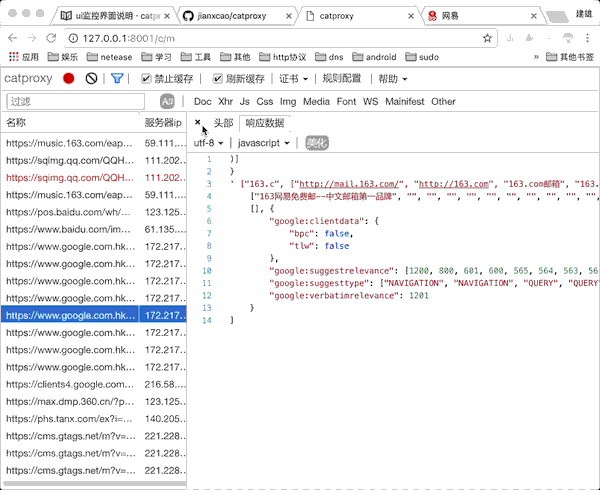

# 监控界面说明

开启catproxy后浏览器输入 `http:127.0.0.1:8001/c/m`将会打开监控页面

如下

该界面类似chrome的调试工具

主要分成2个功能区域

## 导航区域

- 启动按钮，可以启动或者停止监控
- 清空按钮可以清空当前请求列表的请求
- 过滤按钮可以控制过滤工具的显示隐藏
- 缓存按钮可以控制是否启用缓存
- 证书列表可以生成证书
- 规则配置则是返回规则配置的页面

## 请求列表区域

监控也类似chrome，通过一个列表显示请求，单击请求会显示请求的详细信息在右侧

如 

## 动图演示

