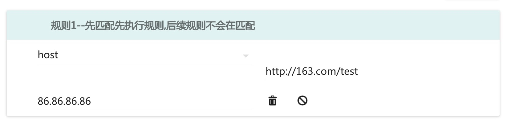
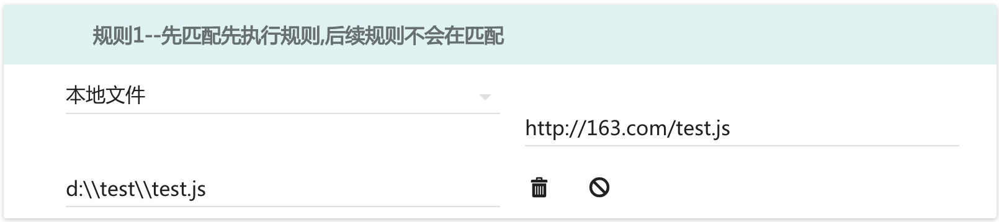
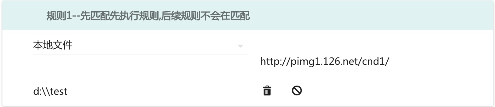
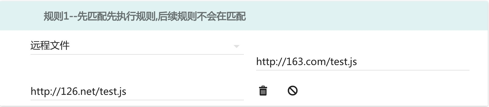
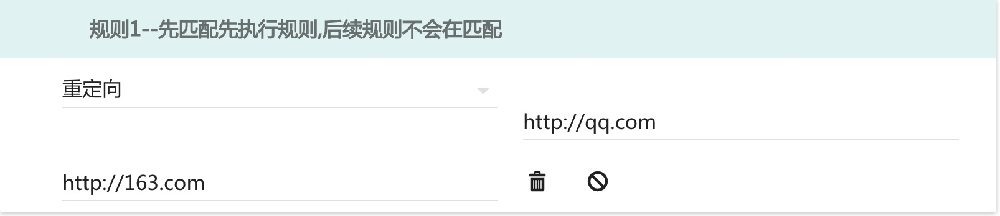
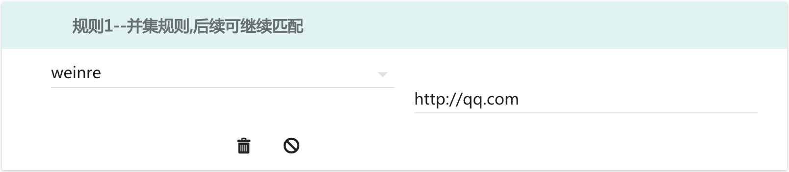
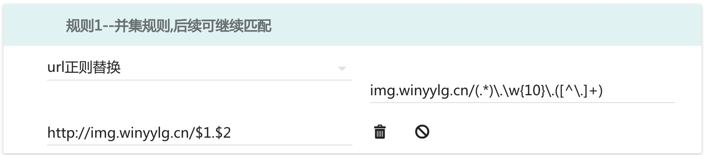

# 规则配置说明

规则类型总共有7个类型

## host
即将一个host地址指定到一个固定的ip下 如 源地址填写`http://163.com/test`,目标地址填写`86.86.86.86`将会将`163.com/test`目录下地都指定到`86.86.86.86`的ip下,其他目录下还是会访问原来得地址
这里如果写协议就会强制使用http协议，如果不写就是HTTP和https都管用

如图

## 本地文件 
如源地址填写`http://163.com/test.js`, 目标地址填写`d:\\test\\test.js`, 将会将`http://163.com/test.js`定位到本地test的文件夹下

`test.js`将会映射到`http://163.com/test.js`

如图

## 本地目录
如源地址填写`http://pimg1.126.net/cnd1/` 目标地址填写`d:\\test`将会在本地磁盘,`test`目录下寻找`cdn1`路径下对应的资源文件

这里有个虚拟路径字段，指的是在url中的路径中的开头有文件中不存在的路径，所以加个虚拟路径，会自动将这个路径去掉，并匹配上

如图

## 远程文件 
如源地址填写`http://163.com/test.js`目标地址填写`http://126.net/test.js`,将会将地址`http://126.net/test.js`的内容加载到 `http://163.com/test.js`下

如图

## 重定向
如源地址填写`http://qq.com`目标地址填写`http://163.com`将会将`qq.com`重定向到`163.com`

如图

## weinre
选择正则替换后将会在源地址中插入`weinre`的`script`，并且开启`weinre`服务器,`weinre`服务器的url会在控制台打印

如图

## 正则替换
源地址的正则的子匹配，目标地址可以通过$1-$9取到并进行替换

如图

